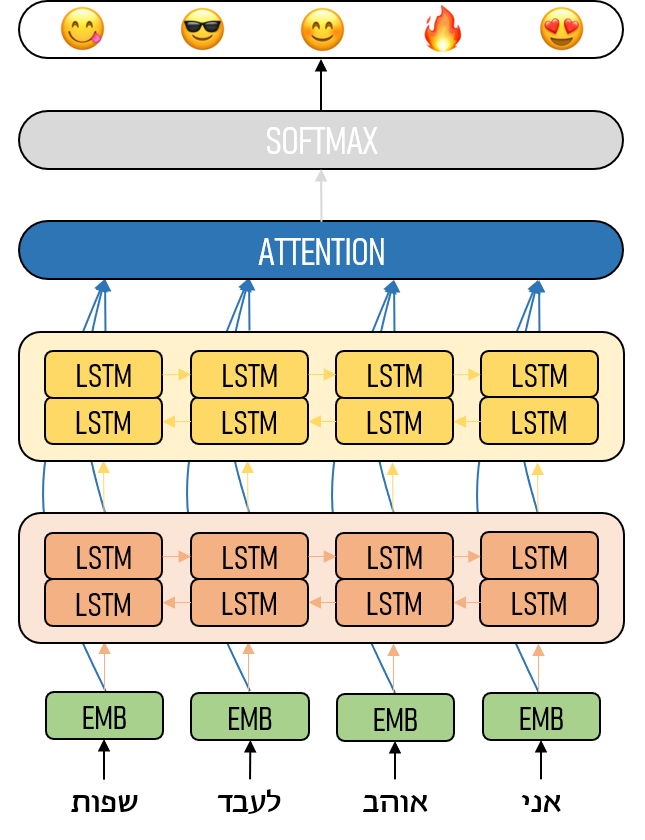

# heMoji

## Sentiment and emotion predictions using emojis for Hebrew text

The heMoji system predicts Emojis for Hebrew text.

It is about time to get some emoji predictions over Hebrew text! The heMoji system predicts emojis for Hebrew texts, and can be used as a basis for more targetted sentiment/emotion/sarcasm detection systems.

heMoji is an adaptation of the Felbo et al (2017)1 English system to Hebrew.

It was developed by Daniel Juravski at the Bar-Ilan natural language processing lab, as part of a larger project on automatic analysis of text in psychotherapy sessions, in order to gain insights on the psychotherapy process (the project is supervised by Prof. Yoav Goldberg from the computer science department and Dr. Dana Atzil from the Psychology department).

The model guesses, for each input, the top-5 emojis that are the most likely to appear with it. This set of emojis often correlates well with the sentiment or emotion that is expressed in the text.

We trained the model by collecting a large sample of Hebrew tweets, each of them containing one of the 64 emojis below (at least 30,000 examples for each emoji, totalling in more than 3.5M tweets). We then "hid" the emojis from the model, who had to learn to predict the correct answer. During this process, the model learned not only to assign emojis to tweets but also how the different emojis relate to each other.

😁 😂 😅 😄 😇 😉 😈 😋 😊 😍 😌 😏 😎 😑 😐 😓 😒 💕 😔 💗 😖 💙 😘 😝 😜 😞 😡 😣 😢 😥 😤 🎧 😰 😩 😫 😪 😭 💜 😱 🎉 😳 ✌ 😴 😷 🎶 ☺ ✋ 👊 🙈 👋 🙊 👍 👌 🙏 🙌 💋 👏 🔥 👎 ♥ ❤ 💪 😕 💔

Beyond the ability to predict the corresponding emoji for the given the input text, the model works well as the basis for other sentiment prediction tasks, using transfer learning. We tested it on the Hebrew sentiment-classification corpus released by Amram et al. (2018)2. Previous best reported results on these datasets achieved sentiment prediction accuracy of 89.20%. After fine-tuning the pre-trained heMoji model on sentiment data, the fine-tuned model achieves an accuracy of 93.16%.
To get more technical, the model is a (by now fairly standard) neural natural language processing architecture: a token-level embedding layer followed by two bi-LSTM layers, an attention layer, and a softmax classification layer.

When fine-tuning, we replace the emoji softmax classification layer by a new sentiment softmax classifier. We then train the new layer while freezing the rest of the network, and then gradually unfreeze the network, fine-tuning the each layer (from first to last) individually. We then fine tune the entire network end-to-end.
While we have our own scientific plans for using the model, we imagine many potential uses for it. To make it easy for others to use the model, we release it as a dockerised 🐋 image which includes an easy-to-use pretrained Keras model and and pre-processing code (coming soon).
---
[1] Felbo, B., Mislove, A., Sogaard, A., Rahwan, I., & Lehmann, S. (2017). Using millions of emoji occurrences to learn any-domain representations for detecting sentiment, emotion and sarcasm. arXiv preprint arXiv:1708.00524.

[2] Amram, A., David, A. B., & Tsarfaty, R. (2018, August). Representations and Architectures in Neural Sentiment Analysis for Morphologically Rich Languages: A Case Study from Modern Hebrew. In Proceedings of the 27th International Conference on Computational Linguistics (pp. 2242-2252).